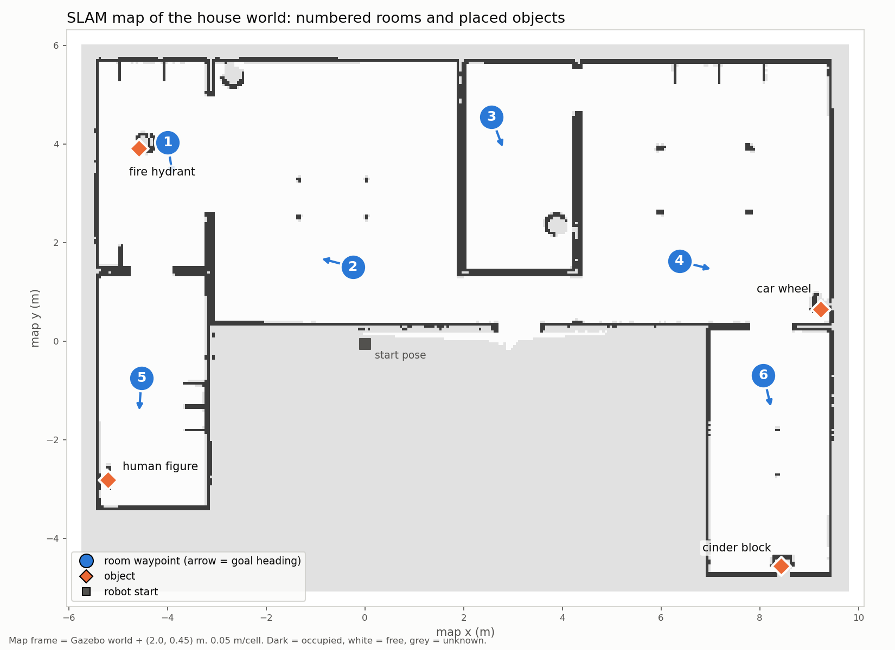

# EE4705 Project 1.2: results summary

Everything here comes from runs logged in `evaluation/` (CSV files, evidence
images, JSON per VLM call). Failed trials are kept. Success is always defined
before the trials that use it; the definitions are in `evaluation/README.md`
and repeated below.

System under test (final configuration): TurtleBot3 Waffle Pi, ROS 2 Humble,
Gazebo Classic 11, Nav2, CycloneDDS. Qwen (`qwen-plus`) parses commands, with
Gemini (`gemini-3.5-flash-lite`) as fallback; Qwen3-VL-Plus describes scenes
and grounds objects for the approach controller.

`docs/diagrams/floor_plan_labelled.png`: the SLAM map with the six numbered
room waypoints (arrow = goal heading) and the four placed objects. Map frame =
Gazebo world + (2.0, 0.45) m.

| Room | Waypoint (map x, y, yaw) | What the robot faces on arrival |
| --- | --- | --- |
| 1 | (-4.00, 4.03, -1.42) | corridor south; fire hydrant 0.6 m behind it |
| 2 | (-0.24, 1.51, 2.89) | fire hydrant, 5 m ahead |
| 3 | (2.56, 4.55, -1.21) | trash can |
| 4 | (6.37, 1.63, -0.24) | car wheel, 3 m ahead |
| 5 | (-4.52, -0.75, -1.64) | human figure (white mannequin) |
| 6 | (8.08, -0.69, -1.34) | table; cinder block behind it |

## 1. Command parser (Task 2.iv)

20 utterances (direct, 5 paraphrases, follow-ups, 3 invalid rooms, 3
out-of-scope, capability questions), same system prompt for both models.

| Parser | Correct | Mean latency | File |
| --- | --- | --- | --- |
| Gemini 3.5 Flash-Lite (Task 2 run) | 20/20 | 0.73 s | `command_parser_trials.csv` |
| Qwen `qwen-plus` | 20/20 | 0.74 s | `command_parser_trials_qwen.csv` |

## 2. VLM comparison (Task 3.iii)

10 Gazebo scenes, same description prompt, temperature 0. Expected objects
checked against each image; every hallucination flag from the keyword scorer
was checked by hand (all 11 were false). An object counts only if it is named.
Details: `evaluation/vlm_comparison.md`, `vlm_scene_trials.csv`.

| | Gemini 3.5 Flash-Lite | Qwen3-VL-Plus |
| --- | --- | --- |
| Objects correctly reported (of 9) | 7 (78%) | 5 (56%) |
| Missed | 2 | 4 (2 described but not named) |
| Hallucinated objects | 0 | 0 |
| Mean latency | 18.3 s (median 3.4 s; 3 calls 43-57 s) | 1.9 s (median 1.9 s, max 2.7 s) |
| Tokens per call (in / out) | 1116 / 39 | 359 / 62 |
| Cost per call | US$0 (free tier) | US$0 (free quota) |

**Chosen for the final system: Qwen3-VL-Plus**, because of latency (10x
lower and consistent), reliability (Gemini returned 503/504 overload errors
and timed out on the test days), and grounding (Qwen-VL is trained to return
boxes; Gemini's one grounding attempt timed out at 30 s). Gemini
named two more objects out of nine; neither model hallucinated.

## 3. Object approach (Task 4.iii)

12 trials: fire hydrant, car wheel, cinder block and the human figure
("person"), each from 3 start poses: straight ahead (2-3.5 m), 15-25 deg
off-centre, and out of view (behind, or 90-120 deg to the side; 4 trials).
The robot is teleported to each start pose; the approach is the same code the
chat runs. `evaluation/object_approach_trials.csv`, evidence images in
`evaluation/task4_evidence/trials/`.

Success = the controller reports arrival AND grounding is correct AND the
robot centre ends within 1.0 m of the object (nearest body link for the
figure, Gazebo ground truth) AND the final laser range is at least 0.20 m.
Grounding correct = the named object is boxed at least once, every box marks
it, and no frame boxes anything else (checked on the images).

The same 12 trials were run three times; run 1's failures drove the fixes.

| Run | Changes | Grounding correct | Approach success | Out-of-view starts | Mean time | VLM calls / trial |
| --- | --- | --- | --- | --- | --- | --- |
| 1 | first controller and prompt | 8/11 (1 N/A) | 4/12 | 0/4 | 25 s | 5.7 |
| 2 | grounding prompt, clearance, sensor and Nav2 fixes | 12/12 | 8/12 | 2/4 | 41 s | 6.0 |
| 3 (final) | + laser-confirmed close arrival, back off before turning | 12/12 | **10/12** | 3/4 | 34 s | 5.5 |

Run 3: final robot-centre-to-object distance 0.44-0.73 m (mean 0.63 m) when
arrived; 66 grounding calls, 43,697 input and 1,834 output tokens, US$0.

| Trial (run 3) | Object | Start | Result | Final distance |
| --- | --- | --- | --- | --- |
| T01 | fire hydrant | ahead, 3.5 m | arrived, 4 calls | 0.70 m |
| T02 | fire hydrant | 20 deg off, 2.5 m | arrived, 3 calls | 0.69 m |
| T03 | fire hydrant | behind, 3.0 m | arrived after 180 deg search, 8 calls | 0.70 m |
| T04 | car wheel | ahead, 3.0 m | arrived, 3 calls | 0.59 m |
| T05 | car wheel | 25 deg off, 3.0 m | arrived, 3 calls | 0.73 m |
| T06 | car wheel | 120 deg right | arrived after search, 9 calls | 0.68 m |
| T07 | cinder block | ahead, behind a table pedestal | arrived (Nav2 detour, laser-confirmed), 4 calls | 0.61 m |
| T08 | cinder block | behind, 2.5 m | **failed**: turn refused next to a wall even after backing off | 1.92 m |
| T09 | cinder block | 20 deg off, 2.0 m | arrived, 3 calls | 0.69 m |
| T10 | person | ahead, 3.2 m | arrived, 4 calls | 0.44 m |
| T11 | person | 90 deg right, 1.2 m | arrived after search, 8 calls | 0.47 m |
| T12 | person | 15 deg off, 2.7 m | **failed**: reached 0.35 m, lost the figure (only feet in view) and the laser check passed between its legs | 0.35 m |

Grounding prompt, before and after, on 12 saved frames with known answers
(`evaluation/grounding_prompt_test.py`): original 6/12 (missed the mannequin in
all 4 frames, missed the small cinder block, boxed a brick pillar as the cinder
block), final 12/12.

## 4. End-to-end trials (Task 5.ii)

20 randomized two-turn conversations through `terminal_chat.handle_turn()`
(the interactive chat's code). A seeded generator (seed 4705) picks the room
(one with an object in view: 2, 4, 5, 6), the object wording (e.g. "tyre",
"grey block", "human figure") and the phrasing of both requests.
`evaluation/end_to_end_trials.csv`, images in `evaluation/e2e_evidence/`.

Success per stage (defined before running):
- **Parsing**: turn 1 -> `goto_room` with the right room AND turn 2 ->
  `approach` naming the target.
- **Navigation**: Nav2 success AND robot within 0.5 m of the waypoint (Gazebo).
- **Description**: the arrival description names the target object and
  names nothing that is not in view (checked on the saved image).
- **Approach**: as in Task 4.iii.
- **End-to-end**: all four in the same trial.

A network outage (TLS interception, then connection errors to both APIs) hit
E11-E18. Those rows are kept and marked; E11-E18 were rerun as E11r2-E18r2
after a simulation restart (the first reruns, E11r/E12r, started with the robot
wedged on the room 6 table base and are also kept and marked). The table uses
the last attempt of each of the 20 planned trials; all 30 rows are in the CSV.

| Stage | Success | Mean latency |
| --- | --- | --- |
| Parsing (both turns) | 13/20 | 1.6 s for the two parser calls |
| Navigation | 20/20 | 49.1 s |
| Description | 10/20 | 1.8 s (capture + VLM) |
| Approach | 10/20 (10 of the 13 that ran) | 46.8 s |
| **End-to-end** | **9/20** | |

By room: room 2 (fire hydrant) 7/7, room 4 (car wheel) 2/3, room 5 (human
figure) 0/5, room 6 (cinder block) 0/5.

API use for these 20 trials: 120 calls (40 parser, 20 description, 60
grounding), 76,923 input and 4,080 output tokens; all 30 rows including the
outage: 188 calls, 85,747 / 4,518 tokens. **Total cost: US$0** (Qwen free
quota; Gemini free tier as parser fallback).

Why trials failed:
- **Parsing (7)**: the dialogue manager refused the approach request when the
  arrival description had not named the object: "I don't see a cinder block
  ... could you clarify?" (4, room 6), "only a pair of white robotic legs"
  (room 5), "I cannot detect or navigate to a person" (room 5), and, after the
  description called it a "robot wheel", "it is part of my own body" (room 4);
  once it mis-routed the request as a visual question.
- **Description (10)**: the mannequin was "robot legs" or "pipes" (5); the
  cinder block was never named, at best "a small black rectangular object"
  (5).
- **Approach (3 of 13 that ran)**: the mannequin's legs were not recognised
  (1); the robot drove onto the flat base of the room 6 table, which the 2D
  laser cannot see, tilted and aborted (1); the table's pedestal blocked the
  straight path and the Nav2 detour failed, leaving the robot wedged (1).

**After the evaluation** the parser prompt gained an "object approach rule"
(always return `approach`; the robot will look for the object itself).
Replaying the 20 logged conversations through the new prompt
(`evaluation/parser_approach_replay.py`) gives 20/20 correct approach parses
(13/20 as logged), and the 20 Task 2 utterances still parse 20/20. This is an
offline check of the parser only; the end-to-end table above is the system as
it was when evaluated.

## 5. Main failure modes

1. **The simulated objects look unlike their names to the VLM.** The white
   mannequin was "robot legs", "pipes" or "a silver pole"; the small dark
   cinder block was "a small black rectangular object". Grounding improved
   from 6/12 to 12/12 once the prompt described the robot's view (simple 3D
   models, a 10 cm camera that sees only the legs of a nearby person), but
   the description prompt was not changed, so descriptions in rooms 5 and 6
   still fail to name the object.
2. **The dialogue manager trusts the description over the user.** After a
   description that did not name the object, the parser refused "move to the
   cinder block" ("I don't see a cinder block ... could you clarify?")
   instead of letting the robot look for it; when a description said "robot
   wheel" it answered that the wheel was part of its own body, and once
   navigation had failed it claimed "there is no fire hydrant inside the
   house". Fixed after the evaluation with an explicit approach rule in the
   prompt (20/20 on the replayed conversations).
3. **Obstacles the 2D laser cannot see.** The room 6 table stands on a flat
   base plate below the 0.13 m scan plane: the robot drove onto it, tilted
   (the camera saw only floor), and in one case was wedged until the
   simulation was restarted.
4. **Close range.** Within ~0.5 m the camera sees only the bottom of tall
   objects, so the VLM loses them; arrival is then confirmed by the laser,
   which can miss thin objects (between the mannequin's legs).
5. **Tight spaces.** Turning in place is refused when any laser return is
   within 0.27 m of the rotation centre; backing off does not always help
   next to walls.
6. **Cloud APIs.** Gemini returned 503/504 errors and 40-57 s responses on
   the test days; a network outage (TLS interception, then connection
   errors) broke 7 end-to-end trials, which were rerun.

## 6. Setup and navigation problems and fixes (Task 1.iv)

| Problem | Symptom | Fix |
| --- | --- | --- |
| NVIDIA driver | *(team to fill in: the exact symptom and driver change on the group laptop)* | *(team)* |
| Missing Gazebo models | the house world's objects did not load (Gazebo could not fetch them) | *(team to confirm)* the models (cafe_table, car_wheel, cinder_block, fire_hydrant, first_2015_trash_can, mailbox, table_marble) were placed in `~/.gazebo/models` |
| Mailbox | a mailbox obstacle in the world/map | removed from the world file (1345e5e) and its cells cleared from the saved map (b29ff52) |
| AMCL drift | AMCL's pose drifted ~0.27 m / 10 deg, so the robot missed the 0.85 m doorway north of the start room | Gazebo's diff-drive odometry is the true world pose and the map is the world shifted by (2.0, 0.45), so a fixed map->odom transform replaces AMCL's (235a679) |
| DWB local goal behind a wall | with a 3 x 3 m local costmap the local goal of the U-turn through that doorway lay behind the wall; the robot faced the wall and stalled | 2 x 2 m local costmap (927f364) |
| Nav2 "TF freeze" | after ~25 min a costmap's robot pose stopped updating while TF was fine elsewhere; plans started from the stale pose and DWB aborted with "Resulting plan has 0 poses". Seen with Fast DDS and, after switching, with CycloneDDS; a lifecycle reset hung | The costmap's own TF listener stopped under load (reliable camera streaming) when its scan MessageFilter waited for TF. Global costmap now uses only the static map; the local costmap reads `/scan_costmap` from `scan_relay`, which forwards a scan only once its transform is in TF. No freeze since in one continuous ~1.5 h simulation session, including 12 navigations with deliberate camera-subscriber churn (29fa8c0, 9790712) |
| Fast DDS -> CycloneDDS | switching to CycloneDDS dropped almost every camera image (0.1 Hz): 1344-byte UDP fragments overflowed the 208 KB socket buffer (raising it needs root) | `config/cyclonedds.xml`: loopback, 64 KB fragments; camera subscribers use RELIABLE QoS (~25 Hz, real-time factor unchanged); camera at 10 Hz |
| Stale script shebangs | plain `colcon build` wrote `#!/usr/bin/python3` into the installed scripts, which cannot import openai / google-genai from the .venv | build with `python3 /usr/bin/colcon build --symlink-install` after sourcing `scripts/activate_ubuntu.sh` |
| gzserver crash | gzserver aborted (boost assertion in `gazebo::transport::Connection`) when timed-out `gz model -p` clients were killed | ground truth read through the `gazebo_ros_state` plugin over ROS instead of the gz CLI |
| Cannot plan after an approach | the robot stops ~0.4 m from an object, but the SLAM map draws objects larger, so its centre was inside the inscribed radius; the planner refused to plan | the chat backs away before navigating when something is close in front |

## 7. Latency and cost at a glance

- Command parsing: ~0.7 s with Qwen (Gemini: 0.7 s on a good day, 20-40 s
  on the test days).
- Navigation between rooms: 30-95 s.
- Scene description: ~2 s (Qwen).
- Object approach: 16-70 s, 3-9 VLM calls.
- All API use was on free tiers: US$0. Token counts are logged per call so
  paid costs can be computed.
